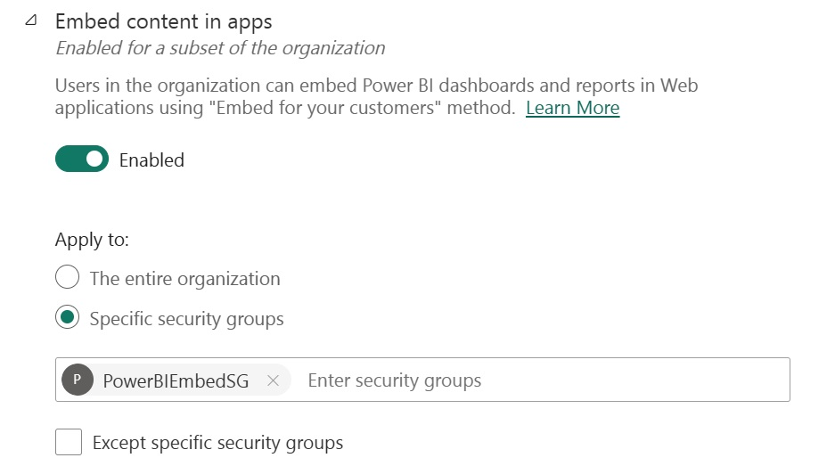
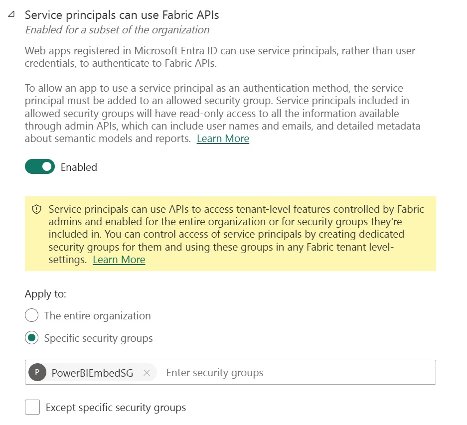

# Setup
In order to use these sample notebooks there is some Azure Infrastructure required.  This section documents the expected resources required to leverage the code as written, and will refer to existing docuemntation wherever possible.

### Power BI Tenant & Entra Configuration
In order to allow embedding of reports, you must enable it in the tenant admin settings.  The setting "Embed content in apps" must be turned on.  This setting can be enabled for the entire organziation, limited to a specific security group, or disabled for specific security groups.   In general it is recommended to only enable this feature for specifc security groups.

For embedding, you can authenticate against Power BI for the purpose of calling the APIs either as a user or as a service principal.  Note: we highly recommend using a Service Principal wherever possible for two reasons:
1. A service principal will not require a Power BI Pro license to execute the necessary APIs.
1. It is exceptioanlly common for Entra Admins to require users to do multi-factor authentication, this makes it impossible to call the API because the authentication reqeusts are not interactive.

Like enabling the embed APIs, you can also restrict the service principal auth to specific security groups. 

Note:  All of the samples in this repo assume service principal authentication.  For more information, this docuemnt: https://learn.microsoft.com/en-us/power-bi/developer/embedded/embed-service-principal covers the process of creating a Service Principal, and configuring the Power BI Tenant to allow the Service Principal to execute APIs.  

### Key Vault
In order to avoid checking in secrets to GitHub, and requiring hard coded passwords and secrets these notebooks all assume you'll be storing senitive data in Azure Key Vault.  You can find the general documentation for setting up KeyVault here:  https://learn.microsoft.com/en-us/azure/key-vault/general/quick-create-portal.  

For the purposes of this code we'll need the folloiwng secrets added to keyvault:
1. pbieclientsecret - This is the certificate created for the application.
1. tenant-n-Id - these is generated automatically and stored in key vault in the notebook advanced/CreateNewTenant.ipynb and represents the client id for a specific tenant.
1. tenant-n-Secret - these are generated automatically and stored in key vault in the notebook advanced/CreateNewTenant.ipynb and stores the authentication secret for the corresponding client id.

It is important to consider how you authenticate against keyvault.   In my development scenario, I ran my notebooks on Azure ML Compute, and granted the managed identity fo the compute access to the keyvault.  This approach prevents me from having to store secrets for connecting to keyvault.  If you're not using this method you could use your local user login and grant that user access to keyvault.

### Power BI / Fabric Capacity
Many of the APIs we're exercising will only work when there is a Power BI Capacity, in the interest of getting the full benefit of these notebooks it assumes that at least a minimum capacity exists.  You can find instructions for creating an assigning a capacity here:  https://learn.microsoft.com/en-us/fabric/admin/service-admin-portal-capacity-settings
